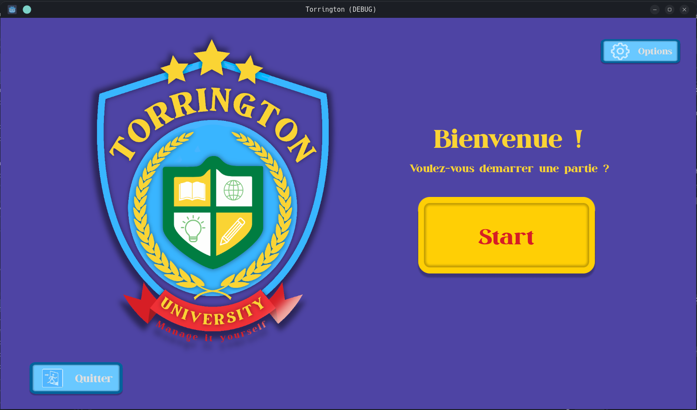
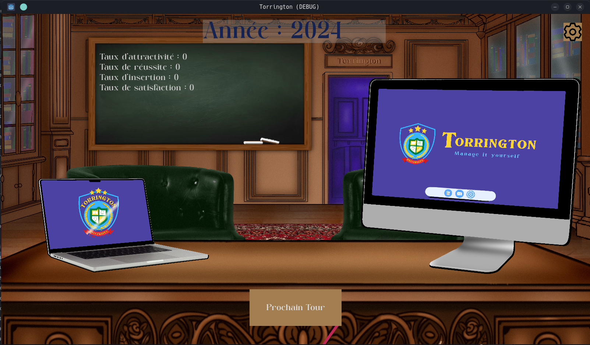
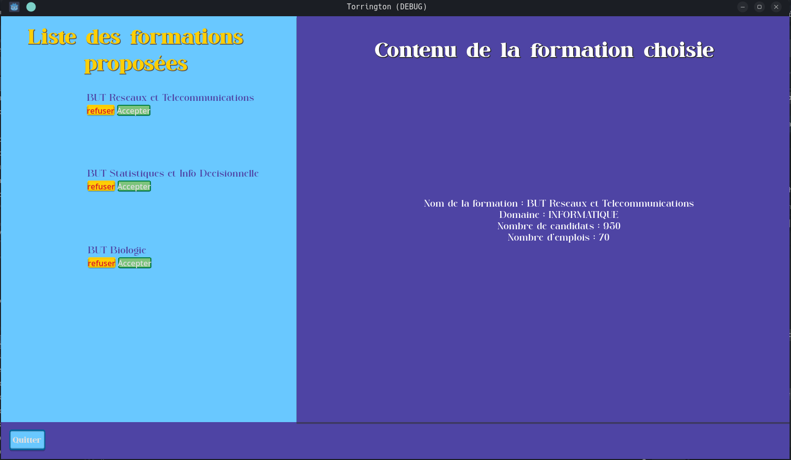
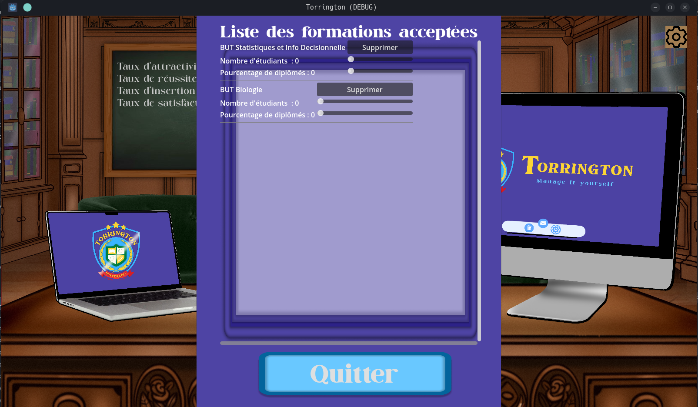
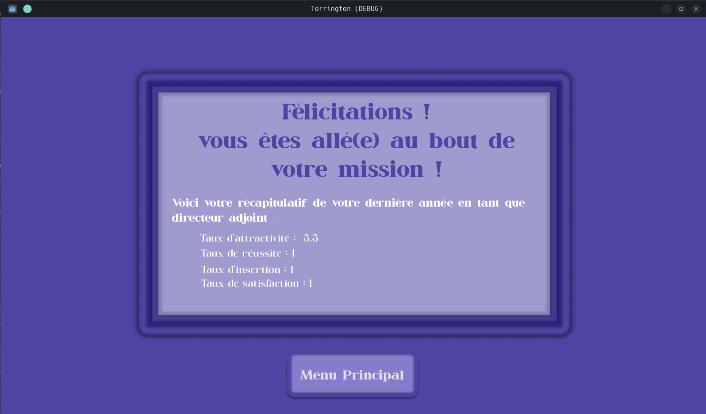

# Torrington: A Serious Game

_A university program selection simulator built with Godot and C#_

## Table of Contents
- [Introduction](#introduction)
- [Features](#features)
- [Getting Started](#getting-started)
  - [Prerequisites](#prerequisites)
  - [Installation](#installation)
  - [Running the Game](#running-the-game)
- [Project Structure](#project-structure)
- [Project Screenshots](#project-screenschots)
- [Contributing](#contributing)
- [License](#license)
- [Credits](#credits)

## Introduction
**Torrington** is a serious game designed to simulate the process of selecting academic programs at a university. The game challenges players to evaluate academic proposals while managing their score and budget.

The game follows the **MVC (Model-View-Controller)** and **Observer design patterns**, ensuring clean code organization and scalability.

## Features
- Gameplay easy to understand and play is focused on academic decisions.
- **SQLite database integration** for data storage.
- Open-source assets and CC BY-NC license.
- Playable on many support (Windows, Linux, MacOS).

## Getting Started

### Prerequisites
- **Git** for cloning the repository.

### Installation
- Clone the repository
    ```bash
    git clone "git@git.unistra.fr:j.goy/t3-jzj.git"
    cd executable
    ```
### Running the game
- Launch the game
    ```bash
    ./ # Select the executable for your OS (Windows : .exe | MACOS : .app | Linux : no extension)
    ```

## To build the game yourself

### Prerequisites
- **Godot Engine (v4.x)** with Mono support.
- **Git** for cloning the repository.
- **.NET SDK** for C# development.
- **SQLite** installed (optional for manual database debugging).

### Installation

#### Linux
1. Clone the repository:
   ```bash
   git clone <repository-url>
   cd Torrington
   ```
2. Open the project in Godot:
   - Launch Godot.
   - Click "Import" and select the `project.godot` file in the cloned folder.

3. Install dependencies (if required):
   ```bash
   dotnet restore
   ```
4. Export the Game
    - Click "Project" and select "Export".
    - Choose Linux and "Export the project".

##### Running the game
- Launch the game
    ```bash
    cd Executable
    ./ # Select the executable for your OS (Windows : .exe | MACOS : .app | Linux : no extension)
    ```

#### Windows
1. Clone the repository:
   ```bash
   git clone <repository-url>
   cd Torrington
   ```
2. Open the project in Godot:
   - Launch Godot.
   - Click "Import" and select the `project.godot` file in the cloned folder.

3. Install dependencies (if required):
   ```bash
   dotnet restore
   ```
4. Export the Game
    - Click "Project" and select "Export"
    - Choose Windows and in the right window go to "Application" and uncheck "ModifyResources"  
    - Click "Export the project"

##### Running the game
- Launch the game
    ```bash
    cd Executable
    ./ # Select the executable for your OS (Windows : .exe | MACOS : .app | Linux : no extension)
    ```
    
## Project Structure
```plaintext
Torrington/
├── Scripts/            # C# scripts for game logic (MVC structure)
│   ├── Controllers/    # Handles user input and manages game state
│   ├── Models/         # Represents the game data (e.g., Proposal.cs)
│   ├── Views/          # UI components and observers
├── Scenes/             # Godot scene files
├── Assets/             # Visual assets
├── torrington/         # Export configurations
│   └── export_presets.cfg
└── README.md           # Project documentation
```

## Project Screenshots






## License
This project is licensed under the [Creative Commons BY-NC 4.0](https://creativecommons.org/licenses/by-nc/4.0/) license.
- **You are free to share and adapt the work,** but commercial use is not allowed.

## Credits
- **Development Team:**
  - Programming: Jules Goy, Ziayd Bouqalba, Juliette Jean.
  - Visual Design: Juliette Jean, Ziyad Bouqalba, Jules Goy.
- Special thanks to the open-source community for their tools and resources.
